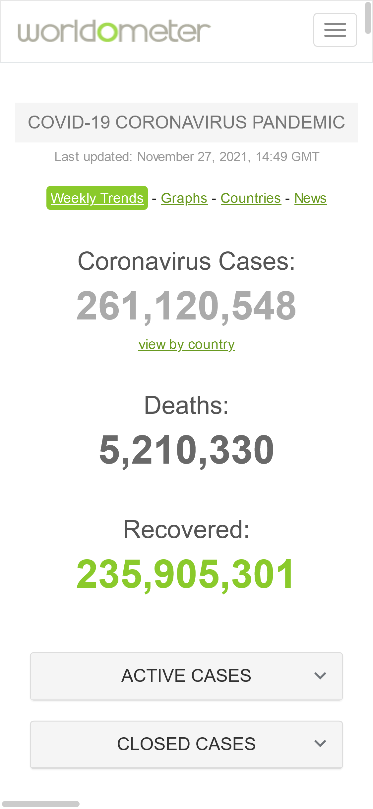
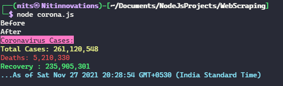

# Web Scraping Coronovirus Cases Stats 📊
## Follwing npm packages were used :
- [x] 1. Request - Simplified HTTP client (to make http calls)
- [x] 2. Cheerio - a Node.js library that helps developers interpret and analyze web pages using a jQuery-like syntax.
- [x] 3. Chalk - For Terminal string styling.

## Screenshots :

> www.worldometers.info website is used to scrape stats.

> Terminal Screenshot